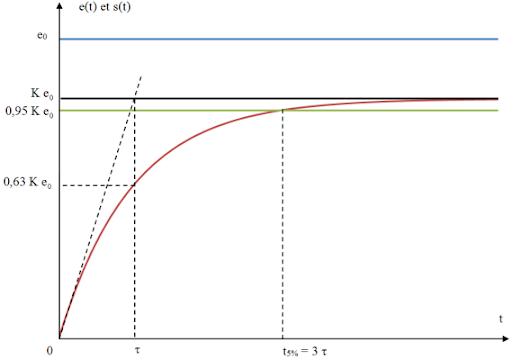
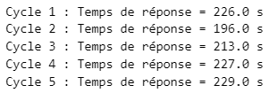
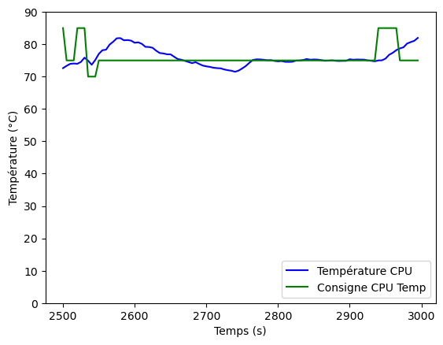

<!--
Author: Benjamin Lepourtois <benjamin.lepourtois@gmail.com>
Copyright: All rights reserved.
See the license attached to the root of the project.
-->

English version below !

# Asservissement et régulation du refroidissement d'une RPi avec un correcteur PID

Le but de ce projet est d'asservir et de réguler le refroidissement d'une Raspberry Pi (RPi). Pour ce faire, j'ai acheté le kit suivant : [Kit RPi4 acheté](https://www.amazon.fr/Bqeel-Alimentation-Interrupteur-Ventilateur-Dissipateur/dp/B082PSBBMM/ref=sr_1_14?dib=eyJ2IjoiMSJ9.8ZfM4XGhIburiNAfEtgKbJFrU5zvWGZoBZ-6HRG4gFjt2i8pjqskQJPU_KjPN7vEdm6KOWqjWq_iFT-oObGvz2xWPGZmdHsSbrJnYXjrB3F7Ad_vnLYooypQqPPFwqQe7gGHJ57mA7NC30jQawqD7L142dfsjkJJnwaJw5LuD1YDDkUX0XS7CnVAGJchgjCAU4LaBSgiruQE6XINpymChrsZDNNicJMLEG-OJog1AwlwJedFPN9K_zxn6UqhTWdGk9F0qHX4Xsbf0k8BBapWVNJrBmAnePdH5uOXKM0Qf_0.QHt9RVqp2MEe4xmj7bZPu1lMkk6QZU34N2WpOzn6x-8&dib_tag=se&keywords=rpi4&qid=1718524926&sr=8-14&th=1).


## Sommaire

- Réalisation d'un module de commande du ventilateur

- Analyse du système : moteur DC, servant de ventilateur

- Calcul de la FTBO, de la FTBF avec le choix d'un correcteur PI

- Réalisation d'un programme C++ complet pour l'asservissement

- Réalisation du programme final

- Création du service "ventilateur.service" sur la RPi

## Réalisation d'un module de commande du ventilateur

Le moteur DC du ventilateur consomme à sa pleine puissance plus de courant que peut en fournir le GPIO (General Purpose Input Output) de la Raspberry Pi 4. Il est donc nécessaire de réaliser un petit montage électronique pour l'adaptation de puissance :


La diode est placée ici comme diode de roue libre pour éviter une tension de contre-électromotrice qui endommagerait les composants autour, notamment le transistor bipolaire. 
<br>
> "La diode de roue libre joue un rôle crucial dans la protection des circuits électroniques en fournissant un chemin de moindre résistance pour le courant induit lors de l'arrêt d'une bobine électromagnétique, prévenant ainsi les dommages causés par les pics de tension."


Nous pouvons désormais contrôler notre moteur en PWM (Pulse Width Modulation) ou MLI (Modulation par Largeur d'Impulsion), ce qui nous permettra de contrôler sa force électromotrice (fem) donc sa vitesse, à l'aide d'un signal TOR (Tout Ou Rien) en modulant la largeur temporelle de l'impulsion (de période fixe).

Sur ce signal, nous pouvons observer :

* Une fréquence de 20Hz (donc la période = 1/20 = 50ms)
* Un rapport cyclique de ~60%
* Une tension minimale de 0V
* Une tension maximale de 3.3V

Nous pouvons en déduire une valeur moyenne d'environ 0.6 \* (3.3 - 0) = 1.98V, ce qui correspondra à la tension perçue par le moteur du ventilateur puisque le moteur DC peut-être assimilé à un filtre passe-bas grâce à sa bobine.

## Analyse du système : moteur DC, servant de ventilateur

Pour analyser le système, nous allons appliquer un échelon en entrée et observer sa réponse. Concrètement, nous allons laisser monter en température la RPi4 avec une utilisation CPU constante jusqu'à ce qu'elle tende vers une température constante, puis nous allons activer le ventilateur avec une commande maximale.


Voici les résultats obtenus avec mon ventilateur sur 5 cycles. J'ai appliqué un filtre passe bas sur le signal enregistré car la mesure du capteur avait du bruit. J'ai réalisé un filtre numérique à Réponse Impulsionnelle Finie (RIF) à 61 points, déduit par tâtonnement. La mesure du temps de réponse de notre système est alors bien plus simple à réaliser et bien plus précise.

L'objectif d'avoir 5 cycles est d'avoir une meilleure précision sur la lecture du temps de réponse du système, qui nous indique son comportement.



À partir de l'analyse de ces réponses indicielles, nous pouvons assimiler notre moteur DC à un système du premier ordre puisqu'il n'a pas de dépassement de sa valeur finale. Voici les temps de réponse obtenus sur les 5 cycles :



Nous choisirons **tau_FTBO = 230s** car qui peut le plus, peut le moins.

Pour ce qui est du tau_FTBF, nous devons respecter la condition **tau_FTBO >= tau_FTBF**. Je choisis donc **tau_FTBF = 300s**.

## Calcul de la FTBO, de la FTBF avec le choix d'un correcteur PI

En pratique, l'ajout d'une action dérivée dans un correcteur PID n'est pas toujours nécessaire pour asservir un moteur DC. Dans de nombreux cas, un correcteur PI bien réglé peut fournir des performances satisfaisantes.

Voici le diagramme bloc que nous obtenons pour notre système en boucle fermée :


Pour le détail des calculs, à partir de la Fonction de Transfert en Boucle Ouverte (FTBO) et de la Fonction de Transfert en Boucle Fermée (FTBF), pour obtenir les coefficients de ki et kp de notre correcteur PI, je vous invite à consulter mes calculs sur ma feuille de calcul.

## Réalisation d'un programme C++ complet pour l'asservissement

Passons maintenant à la partie programmation ! J'ai réalisé un programme C++ permettant de réaliser le correcteur PID, de lire la température du CPU, de lire l'utilisation du CPU (en %) et d'enregistrer les performances du correcteur PI dans un fichier CSV. Ce fichier CSV peut ensuite être analysé par un petit script Python que j'ai réalisé sur un Jupyter Notebook. Voici les performances obtenues :



**Remarques** :

* La consigne de température varie en fonction du pourcentage d'utilisation du CPU puisque le ventilateur n'a pas la capacité à maintenir une température basse avec une utilisation du CPU élevée.
* Le ventilateur n'agit que sur la décroissance de la température du CPU, ce qui implique que nous utilisons l'inertie thermique du CPU pour la croissance de la température du CPU !

Dans le code, j'ai utilisé différentes boucles "for" imbriquées pour optimiser l'utilisation du CPU et éviter les erreurs de mesure de la sonde de température du CPU.
* La première permet de ne pas effectuer trop de vidages du vecteur dans le fichier CSV dans un laps de temps, ce qui permet de diminuer significativement l'utilisation du CPU
* La seconde permet de scanner 3 fois moins souvent l'utilisation du CPU qu'une période d'application d'une valeur PWM, cela permet de ne pas changer la consigne de température trop vite, et donc que l'action intégrale ne s'emballe pas sur une impulsion. 
* La troisième permet de lire 10 fois plus vite la température du CPU (puis de faire la moyenne), pour filtrer les erreurs de mesure de la sonde de température du CPU.

### Partie de tests

#### 1. Asservissement :

> "Une grandeur physique doit suivre une évolution temporelle imposée par l'utilisateur du système.", [Livre : Régulation industrielle, édition Dunod](https://www.dunod.com/sciences-techniques/regulation-industrielle-outils-modelisation-methodes-et-architectures-commande-1)

Nous allons garder une utilisation CPU basse (peu de perturbations) et analyser les performances du système en statique (erreur statique) et en dynamique (temps de réponse, dépassement, stabilité).

#### 2. Régulation :

> "Une grandeur physique doit être maintenue à un niveau constant en dépit de la présence de perturbations.", [Livre : Régulation industrielle, édition Dunod](https://www.dunod.com/sciences-techniques/regulation-industrielle-outils-modelisation-methodes-et-architectures-commande-1)

Nous allons augmenter l'utilisation du CPU, sur les différentes plages d'utilisation du CPU (0-25%, 25-50%, 50-75% et 75-100%), pour créer des perturbations. Nous pouvons effectuer l'augmentation de l'utilisation du CPU en lançant un ou plusieurs scripts de machine learning sur la RPi4. Ces scripts viennent de [ce dépôt](https://github.com/ageron/handson-ml3.git) lié au livre d'Aurélien Géron : [Hands-On Machine Learning with Scikit-Learn, Keras, and TensorFlow](https://www.oreilly.com/library/view/hands-on-machine-learning/9781098125967/), pour apprendre le ML.

Nous allons également analyser les performances du système en statique (erreur statique) et en dynamique (temps de réponse, dépassement, stabilité).

C'est sur cette partie principalement que nous allons, par tâtonnement, ajuster les 2 coefficients de notre correcteur PI pour que le système en boucle fermée réponde à nos exigences !

## Réalisation du programme final

Pour réaliser ce programme final, qui fonctionnera en continu sur notre RPi, nous allons reprendre le code complet réalisé précédemment, y supprimer la partie enregistrement dans un fichier CSV et y rajouter une condition d'activation de l'asservissement que s'il est entre 7h et 00h (puisque je dors après) !

## Création du service "ventilateur.service" sur la RPi

Après compilation du programme C++ final, nous pouvons déplacer notre fichier binaire dans notre répertoire /opt (dédié pour cela) et le renommer :

```
> ~/PID_control_RPi_cooling/PID_control_ventilator $ mv main.bin /opt
> ~/PID_control_RPi_cooling/PID_control_ventilator $ cd /opt
> /opt $ mv main.bin PI_ventilateur.bin
```

Nous pouvons ensuite créer notre service :

```
> ~ $ sudo nano /etc/systemd/system/ventilateur.service
```

Il faut alors éditer votre service (exemple : le mien) :

```
[Unit]
Description=Run Ventilator controlled with PI
After=multi-user.target

[Service]
ExecStart=/opt/PI_ventilateur.bin
Restart=always

[Install]
WantedBy=multi-user.target
```

Puis l'enregistrer (Ctrl+X puis taper "y" puis appuyer 2 fois sur la touche "Entrée").

Nous pouvons alors activer notre service et le mettre en service :

```
> ~ $ systemctl enable ventilateur.service
> ~ $ systemctl start ventilateur.service
```

Pour connaître l'état de notre service :

```
> ~ $ systemctl status ventilateur.service
```

Pour arrêter notre service :

```
> ~ $ systemctl stop ventilateur.service
```

**En espérant que vous ayez trouvé cette description complète et concise et que le projet vous a plu !**

<br><br>
***
<br>

# PID Control and Regulation of RPi Cooling

The aim of this project is to control and regulate the cooling of a Raspberry Pi (RPi) using a PID controller. To do this, I purchased the following kit: [RPi4 Kit](https://www.amazon.fr/Bqeel-Alimentation-Interrupteur-Ventilateur-Dissipateur/dp/B082PSBBMM/ref=sr_1_14?dib=eyJ2IjoiMSJ9.8ZfM4XGhIburiNAfEtgKbJFrU5zvWGZoBZ-6HRG4gFjt2i8pjqskQJPU_KjPN7vEdm6KOWqjWq_iFT-oObGvz2xWPGZmdHsSbrJnYXjrB3F7Ad_vnLYooypQqPPFwqQe7gGHJ57mA7NC30jQawqD7L142dfsjkJJnwaJw5LuD1YDDkUX0XS7CnVAGJchgjCAU4LaBSgiruQE6XINpymChrsZDNNicJMLEG-OJog1AwlwJedFPN9K_zxn6UqhTWdGk9F0qHX4Xsbf0k8BBapWVNJrBmAnePdH5uOXKM0Qf_0.QHt9RVqp2MEe4xmj7bZPu1lMkk6QZU34N2WpOzn6x-8&dib_tag=se&keywords=rpi4&qid=1718524926&sr=8-14&th=1).


## Table of contents

- Design of a ventilator control module

- System Analysis: DC Motor as a ventilator

- Calculation of the FTBO, FTBF with the choice of a PI controller

- Complete C++ Program for Control

- Final Program Realization

- Creation of the "ventilateur.service" service on the RPi

## Design of a ventilator control module

The DC motor of the ventilator consumes more current at full power than the GPIO (General Purpose Input Output) of the Raspberry Pi 4 can provide. Therefore, it is necessary to make a small electronic circuit for power adaptation:


The diode is placed here as a freewheeling diode to prevent a counter-electromotive force that could damage the surrounding components, especially the bipolar transistor.
<br>
> "The freewheeling diode plays a crucial role in protecting electronic circuits by providing a path of least resistance for the induced current when an electromagnetic coil stops, thus preventing damage caused by voltage spikes."


We can now control our motor using PWM (Pulse Width Modulation), which will allow us to control its electromotive force and therefore its speed, using a binary signal by modulating the temporal width of the pulse (of fixed period).

On this signal, we can observe:

* A frequency of 20Hz (therefore the period = 1/20 = 50ms)
* A duty cycle of ~60%
* A minimum voltage of 0V
* A maximum voltage of 3.3V

We can deduce an average value of approximately 0.6 \* (3.3 - 0) = 1.98V, which will correspond to the voltage perceived by the ventilator motor since the DC motor can be assimilated to a low-pass filter thanks to its coil.

## System Analysis: DC Motor as a ventilator

To analyze the system, we will apply a step input and observe its response. Specifically, we will let the RPi4 heat up with constant CPU usage until it tends towards a constant temperature, and then we will activate the ventilator with a maximum command.


Here are the results obtained with my ventilator over 5 cycles. I applied a low-pass filter to the recorded signal because the sensor measurement had noise. I made a 61-point Finite Impulse Response (FIR) digital filter, deduced by trial and error. The measurement of the response time of our system is then much simpler and more accurate.

The objective of having 5 cycles is to have better precision in reading the response time of the system, which indicates its behavior.


Based on the analysis of these step responses, we can consider our DC motor as a first-order system since it does not have any overshoot of its final value. Here are the response times obtained over the 5 cycles:


We will choose **tau\_FTBO = 230s** because who can do more, can do less.

As for tau\_FTBF, we must respect the condition **tau\_FTBO >= tau\_FTBF**. I choose **tau\_FTBF = 300s**.

## Calculation of the FTBO, FTBF with the choice of a PI controller

In practice, adding a derivative action in a PID controller is not always necessary to control a DC motor. In many cases, a well-tuned PI controller can provide satisfactory performance.

Here is the block diagram we obtain for our closed-loop system:


For the detail of the calculations, from the Open-Loop Transfer Function (FTBO) and the Closed-Loop Transfer Function (FTBF), to obtain the ki and kp coefficients of our PI controller, I invite you to consult my calculations on my calculation sheet.

## Complete C++ Program for Control

Now let's move on to the programming part! I made a C++ program that allows to implement the PID controller, to read the CPU temperature, to read the CPU usage (in %) and to record the performance of the PI controller in a CSV file. This CSV file can then be analyzed by a small Python script that I made on a Jupyter Notebook. Here are the performances obtained:


**Notes:**

* The temperature setpoint varies depending on the CPU usage percentage since the ventilator does not have the capacity to maintain a low temperature with high CPU usage.
* The ventilator only acts on the decrease of the CPU temperature, which implies that we use the thermal inertia of the CPU for the increase of the CPU temperature!

In the code, I used different nested "for" loops to optimize CPU usage and avoid measurement errors of the CPU temperature sensor.
* The first one allows not to perform too many vector empties in the CSV file in a short time, which allows to significantly decrease the CPU usage.
* The second one allows to scan 3 times less often the CPU usage than a PWM value application period, this allows not to change the temperature setpoint too quickly, and therefore that the integral action does not get out of control on an impulse.
* The third one allows to read the CPU temperature 10 times faster (and then make the average), to filter the measurement errors of the CPU temperature sensor.

### Test Part

#### 1. Control:

> "A physical quantity must follow a temporal evolution imposed by the user of the system.", [Book: Régulation Industrielle, Dunod edition](https://www.dunod.com/sciences-techniques/regulation-industrielle-outils-modelisation-methodes-et-architectures-commande-1)

We will keep a low CPU usage (few disturbances) and analyze the performance of the system in static (static error) and dynamic (response time, overshoot, stability).

#### 2. Regulation:

> "A physical quantity must be maintained at a constant level despite the presence of disturbances.", [Book: Régulation Industrielle, Dunod edition](https://www.dunod.com/sciences-techniques/regulation-industrielle-outils-modelisation-methodes-et-architectures-commande-1)

We will increase the CPU usage, on the different CPU usage ranges (0-25%, 25-50%, 50-75% and 75-100%), to create disturbances. We can increase the CPU usage by launching one or more machine learning scripts on the RPi4. These scripts come from [this repository](https://github.com/ageron/handson-ml3.git) linked to Aurélien Géron's book: [Hands-On Machine Learning with Scikit-Learn, Keras, and TensorFlow](https://www.oreilly.com/library/view/hands-on-machine-learning/9781098125967/), to learn ML.

We will also analyze the performance of the system in static (static error) and dynamic (response time, overshoot, stability).

It is mainly on this part that we will adjust, by trial and error, the 2 coefficients of our PI controller so that the closed-loop system meets our requirements!

## Final Program Realization

To make this final program, which will run continuously on our RPi, we will take the complete code made previously, remove the part of recording in a CSV file and add a condition of activation of the control if it is between 7h and 00h (since I sleep after)!

## Creation of the "ventilateur.service" service on the RPi

After compiling the final C++ program, we can move our binary file to our /opt directory (dedicated for this) and rename it:

```
> ~/PID_control_RPi_cooling/PID_control_ventilator $ mv main.bin /opt
> ~/PID_control_RPi_cooling/PID_control_ventilator $ cd /opt
> /opt $ mv main.bin PI_ventilateur.bin
```

We can then create our service:

```
> ~ $ sudo nano /etc/systemd/system/ventilateur.service
```

You should then edit your service (example: mine):

```
[Unit]
Description=Run Ventilator controlled with PI
After=multi-user.target

[Service]
ExecStart=/opt/PI_ventilateur.bin
Restart=always

[Install]
WantedBy=multi-user.target
```

Then save it (Ctrl+X then type "y" then press twice the "Enter" key).

We can then enable our service and start it:

```
> ~ $ systemctl enable ventilateur.service
> ~ $ systemctl start ventilateur.service
```

To know the status of our service:

```
> ~ $ systemctl status ventilateur.service
```

To stop our service:

```
> ~ $ systemctl stop ventilateur.service
```

**Hoping that you found this description complete and concise and that the project pleased you!**